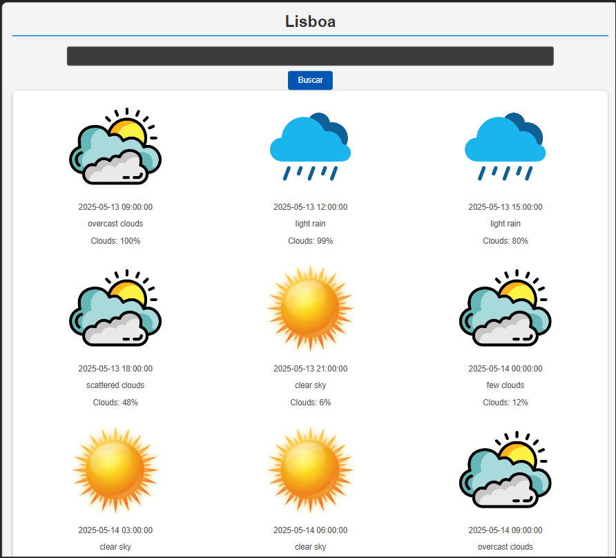

# 🌦️ Weather App con React

Este proyecto es una aplicación simple de clima desarrollada con **React** que muestra la información meteorológica de una ciudad en los proximos 3 dias mediante la API de **OpenWeatherMap**. Además, utiliza la API de **ipinfo.io** para detectar la ciudad del usuario y mostrar automáticamente su clima local al iniciar la app.

---

## 🔗 Demo en producción

👉 [https://cheerful-pegasus-a503e1.netlify.app](https://cheerful-pegasus-a503e1.netlify.app)

---

## ✨ Funcionalidades

- ✅ Proyecto realizado con React.
- 🌍 Llamada a la API de ipinfo.io para obtener la ciudad actual mediante la IP del usuario.
- 🏙️ Llamada a la API de OpenWeatherMap para mostrar el clima de la ciudad.
- 📥 Al iniciar la app, se detecta la ciudad actual y se muestra automáticamente el tiempo.
- 🔄 Manejo de formulario con `setValue` y `setPosts` para cambiar la ciudad manualmente.
- 📡 Uso de `axios` para las llamadas HTTP a las APIs.
- 🔃 Al cambiar de ciudad, se hace una nueva llamada a la API y se actualiza la información en pantalla.

---

## 🧰 Tecnologías utilizadas

- React
- React Hooks: `useState`, `useEffect`
- Axios
- OpenWeatherMap API
- IPinfo API

---

## 🖼️ Capturas de pantalla

### 🏙️ Clima en las ciudades
<p align="center">
  
</p>


---

## 🚀 Cómo iniciar el proyecto

```bash
# Clona el repositorio
git clone https://github.com/jonha20/WeatherAppReact.git
cd WeatherAppReact

# Instala las dependencias
npm install

# Crea tu archivo de entorno
cp .env.example .env
